Hello Fresh - Predicting the next order's value
================

Clement Lefevre 2017-06-22

Assignment for a Data Scientist training position at HelloFresh Berlin.

Part 1 : EDA and features selection.
====================================

``` r
library(dplyr)
```

    ## 
    ## Attaching package: 'dplyr'

    ## The following objects are masked from 'package:stats':
    ## 
    ##     filter, lag

    ## The following objects are masked from 'package:base':
    ## 
    ##     intersect, setdiff, setequal, union

``` r
library(stringr)
library(tidyr)
library(ggplot2)
library(lubridate)
```

    ## 
    ## Attaching package: 'lubridate'

    ## The following object is masked from 'package:base':
    ## 
    ##     date

``` r
library(caret)
```

    ## Loading required package: lattice

``` r
library(GGally)
```

    ## 
    ## Attaching package: 'GGally'

    ## The following object is masked from 'package:dplyr':
    ## 
    ##     nasa

``` r
library(ggthemes)
library(RColorBrewer)
sessionInfo()
```

    ## R version 3.4.0 (2017-04-21)
    ## Platform: x86_64-pc-linux-gnu (64-bit)
    ## Running under: Ubuntu 16.04.2 LTS
    ## 
    ## Matrix products: default
    ## BLAS: /usr/lib/openblas-base/libblas.so.3
    ## LAPACK: /usr/lib/libopenblasp-r0.2.18.so
    ## 
    ## locale:
    ##  [1] LC_CTYPE=en_US.UTF-8       LC_NUMERIC=C              
    ##  [3] LC_TIME=de_DE.UTF-8        LC_COLLATE=en_US.UTF-8    
    ##  [5] LC_MONETARY=de_DE.UTF-8    LC_MESSAGES=en_US.UTF-8   
    ##  [7] LC_PAPER=de_DE.UTF-8       LC_NAME=C                 
    ##  [9] LC_ADDRESS=C               LC_TELEPHONE=C            
    ## [11] LC_MEASUREMENT=de_DE.UTF-8 LC_IDENTIFICATION=C       
    ## 
    ## attached base packages:
    ## [1] stats     graphics  grDevices utils     datasets  methods   base     
    ## 
    ## other attached packages:
    ##  [1] RColorBrewer_1.1-2 ggthemes_3.4.0     GGally_1.3.0      
    ##  [4] caret_6.0-76       lattice_0.20-35    lubridate_1.6.0   
    ##  [7] ggplot2_2.2.1      tidyr_0.6.2        stringr_1.1.0     
    ## [10] dplyr_0.5.0       
    ## 
    ## loaded via a namespace (and not attached):
    ##  [1] Rcpp_0.12.10       nloptr_1.0.4       compiler_3.4.0    
    ##  [4] plyr_1.8.4         iterators_1.0.8    tools_3.4.0       
    ##  [7] digest_0.6.10      lme4_1.1-13        evaluate_0.10     
    ## [10] tibble_1.3.0       gtable_0.2.0       nlme_3.1-131      
    ## [13] mgcv_1.8-17        Matrix_1.2-10      foreach_1.4.3     
    ## [16] DBI_0.6-1          parallel_3.4.0     yaml_2.1.14       
    ## [19] SparseM_1.77       knitr_1.15.1       MatrixModels_0.4-1
    ## [22] stats4_3.4.0       rprojroot_1.2      grid_3.4.0        
    ## [25] nnet_7.3-12        reshape_0.8.6      R6_2.2.0          
    ## [28] rmarkdown_1.5      minqa_1.2.4        reshape2_1.4.2    
    ## [31] car_2.1-4          magrittr_1.5       splines_3.4.0     
    ## [34] backports_1.0.5    scales_0.4.1       codetools_0.2-15  
    ## [37] ModelMetrics_1.1.0 htmltools_0.3.6    MASS_7.3-47       
    ## [40] assertthat_0.2.0   pbkrtest_0.4-7     colorspace_1.3-2  
    ## [43] quantreg_5.33      stringi_1.1.2      lazyeval_0.2.0    
    ## [46] munsell_0.4.3

### Read the data

``` r
data <- read.csv("UKretail.csv",stringsAsFactors = FALSE)
str(data)
```

    ## 'data.frame':    325145 obs. of  8 variables:
    ##  $ InvoiceNo  : chr  "536365" "536365" "536365" "536365" ...
    ##  $ StockCode  : chr  "22752" "71053" "84029G" "85123A" ...
    ##  $ Description: chr  "SET 7 BABUSHKA NESTING BOXES" "WHITE METAL LANTERN" "KNITTED UNION FLAG HOT WATER BOTTLE" "WHITE HANGING HEART T-LIGHT HOLDER" ...
    ##  $ Quantity   : int  2 6 6 6 6 3 3 4 6 6 ...
    ##  $ InvoiceDate: chr  "2010-12-01 08:26:02" "2010-12-01 08:26:02" "2010-12-01 08:26:02" "2010-12-01 08:26:02" ...
    ##  $ UnitPrice  : num  7.65 3.39 3.39 2.55 1.85 5.95 5.95 7.95 1.65 2.1 ...
    ##  $ CustomerID : int  17850 17850 17850 17850 17850 13047 13047 13047 13047 13047 ...
    ##  $ Country    : chr  "United Kingdom" "United Kingdom" "United Kingdom" "United Kingdom" ...

### Format date time, remove cancelled orders and negative prices

``` r
df<-data
df$InvoiceDate <-as_datetime((df$InvoiceDate))
df$OrderValue <- df$Quantity * df$UnitPrice

## Drop the negative invoices
df<- df %>% filter(df$OrderValue>=0)

## drop the cancelled invoices
df<- df %>% filter(!grepl("^C",InvoiceNo))
```

### Aggregate by CustomerID and InvoiceID :

``` r
df.per.CustomerID.InvoiceID <- df %>% group_by(CustomerID,InvoiceNo,InvoiceDate,Country) %>% summarise(TotalValue=sum(OrderValue)) 
df.per.CustomerID.InvoiceID<- df.per.CustomerID.InvoiceID %>% group_by(CustomerID)  %>% mutate(PreviousInvoiceDate = lag(InvoiceDate))
df.per.CustomerID.InvoiceID <- df.per.CustomerID.InvoiceID %>%  arrange(desc(InvoiceDate)) %>% mutate(order_sequence=row_number())
df.per.CustomerID.InvoiceID$ReorderLeadTime<-df.per.CustomerID.InvoiceID$InvoiceDate-df.per.CustomerID.InvoiceID$PreviousInvoiceDate
df.per.CustomerID.InvoiceID$ReorderLeadTime <- df.per.CustomerID.InvoiceID$ReorderLeadTime /(60*60*24)
```

Exploratory Data Analysis
-------------------------

### Distribution of the invoice's value

``` r
# filter on the 97 percentile
q.97<-quantile(df.per.CustomerID.InvoiceID$TotalValue,.97)
ggplot(df.per.CustomerID.InvoiceID %>% filter(TotalValue<q.97) ,aes(x=TotalValue))+geom_histogram(bins =50,fill="steelblue") +theme_fivethirtyeight()+ ggtitle("Distribution of the 97 Percentile for Invoice Values (GBP")
```

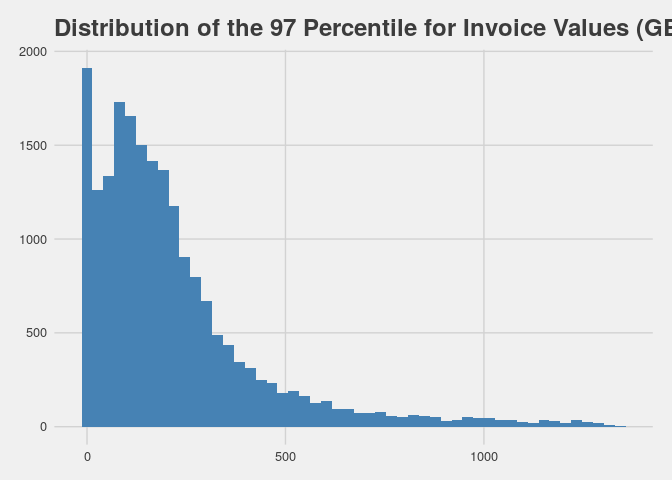

From the spread, we observe a right-skewness, thus it might be useful to use the **log values** to get a balanced distribution.

### group per cohort

A quick overview of customer purchasing analysis led me to the concept of cohort : group the customer according to their first purchase date. Thus i use a per-month basis to define those cohorts.

``` r
df.firstInvoice <-df %>%
  group_by(CustomerID) %>%
  arrange(InvoiceDate) %>%
  filter(row_number()==1 )

df.firstInvoice$cohort<- as.Date(floor_date(df.firstInvoice$InvoiceDate, "month"))
groupy_cohort<- df.firstInvoice %>% group_by(cohort) %>% summarise(total_customers=n())

ggplot(data=groupy_cohort,aes(x=cohort,y=total_customers))+geom_bar(stat = "identity", fill="steelblue")
```

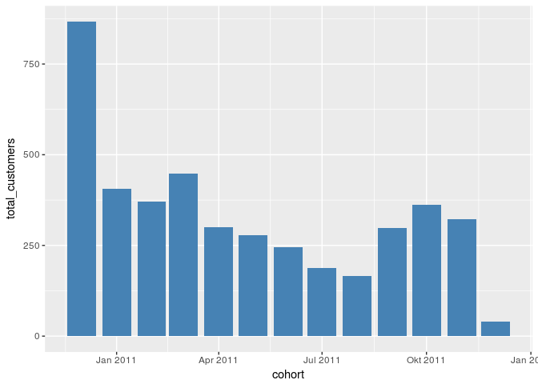

The first cohort (first invoice in December 2010) should not be taken into account, as it also include Customers having first ordered before 1st December 2010. The last cohort (December 2011) is incomplete and should also be dropped.

### Frequency and Value of Orders per cohort

``` r
df.per.CustomerID <- merge(x=df.per.CustomerID.InvoiceID,y=df.firstInvoice[, c("CustomerID","cohort")],by="CustomerID",all.x=TRUE)

df.per.CustomerID<-df.per.CustomerID%>% filter(cohort>"2010-12-01" & cohort<"2011-12-01" )

groupy_frequency <- df.per.CustomerID %>% filter(!is.na(ReorderLeadTime)) %>%  group_by(CustomerID,cohort) %>% summarise(average.ReorderLeadTime=mean(ReorderLeadTime),number_orders=n(), orders_value=mean(TotalValue))

groupy_frequency_cohort<- groupy_frequency %>% group_by(cohort) %>% summarise(average.ReorderLeadTime=mean(average.ReorderLeadTime),average.Orders=mean(number_orders),average_orders_value=mean(orders_value))


ggplot(data=groupy_frequency_cohort,aes(x=cohort,y=average.ReorderLeadTime))+ geom_bar(stat = "identity",fill="steelblue")+ggtitle("Average reorder Leadtime (days) per cohort")
```

    ## Don't know how to automatically pick scale for object of type difftime. Defaulting to continuous.

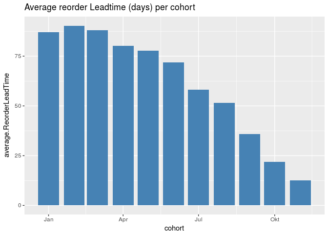

``` r
ggplot(data=groupy_frequency_cohort,aes(x=cohort,y=average.Orders))+ geom_bar(stat = "identity",fill="steelblue")+ggtitle("Average number of order per cohort")
```

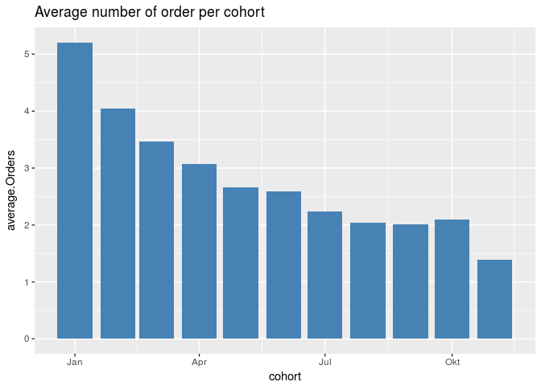

``` r
ggplot(data=groupy_frequency_cohort,aes(x=cohort,y=average_orders_value))+ geom_bar(stat = "identity",fill="steelblue")+ggtitle("Average order value (GBP) per cohort")
```

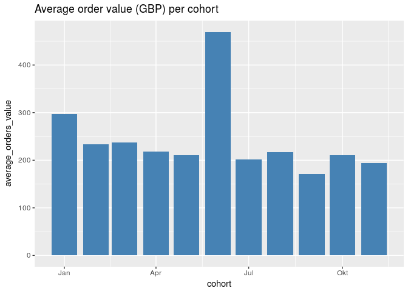 Interesting enough, the average order value tends to decrease when the cohort gets younger, with an outlier in June 2011.

### Number of orders per cohort

``` r
ggplot(data =groupy_frequency,aes(x=cohort,y=number_orders,group=cohort)) + geom_boxplot()
```

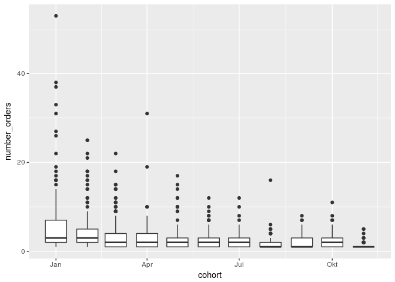

### Importance of the country for the order value

``` r
groupy_country <- df.per.CustomerID.InvoiceID %>% group_by(CustomerID,Country) %>% summarise(average_order_value = mean(TotalValue), number_orders = n())
ggplot(data=groupy_country %>% filter(average_order_value<2000),aes(x=Country,y=average_order_value))+geom_boxplot()+theme(axis.text.x=element_text(angle=90,hjust=1,vjust=0.5,size=8))
```

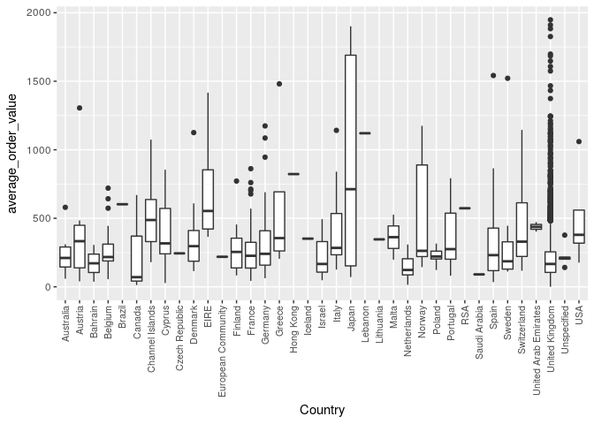

``` r
ggplot(data=groupy_country %>% filter(number_orders<500) ,aes(x=Country,y=number_orders))+geom_boxplot()+theme(axis.text.x=element_text(angle=90,hjust=1,vjust=0.5,size=8))
```

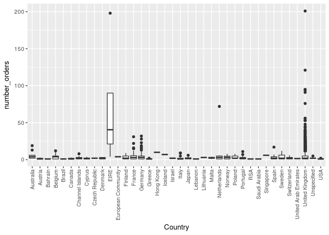

``` r
mean(groupy_country$number_orders)
```

    ## [1] 4.73694

According to this chart, the order value seems to be correlated with the country of origin. We can thus keep this feature as a good predictor for the next Order Value. When looking at the distribution of orders per customer for each country, with the exception of EIRE, the average number of order is around 5.

### Define products categories

``` r
groupy.StockCode<- df %>% group_by(StockCode) %>% summarise(TotalOrderValue = sum(OrderValue)) %>% arrange(desc(TotalOrderValue)) %>% top_n(100,TotalOrderValue)
length(unique(df$StockCode))
```

    ## [1] 3937

``` r
sum(groupy.StockCode$TotalOrderValue)/sum(df$OrderValue)
```

    ## [1] 0.3382488

``` r
ggplot(data=groupy.StockCode,aes(x=reorder(StockCode, TotalOrderValue),y=TotalOrderValue))+geom_bar(stat = "identity", fill="steelblue")+theme(axis.text.x=element_text(angle=90,hjust=1,vjust=0.5,size=6))+ggtitle("TurnOver (GBP) for the top 100 products")+scale_color_brewer(palette="Dark2")
```

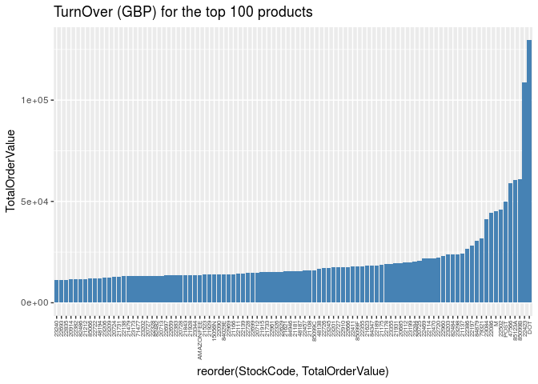

``` r
top.selling.products<- groupy.StockCode$StockCode
```

The top 100 Products (2.5% of the total catalog) accounts to one third of the total TurnOver, we could as a matter of keeping it simple, define a new variable for each customer and each order, whether he did order one of those items.

Ideally, we should cluster the StockCode to define groups of buying profiles, but given the number of features (3937), such a sparse matrix would be hard to handle on a laptop. An other approach would to be define sub-groups of product (Bags, Boxes, Pen, etc...) using word vectorization on the variable Description, as i could not find a logic within the coding of the products.

### Influence of the ReorderLeadtime on the average Order Value

``` r
groupy_reoderLT_orderValue <- df.per.CustomerID.InvoiceID %>% group_by(CustomerID) %>% summarise(average_LT=as.numeric(mean(ReorderLeadTime,na.rm=TRUE)), average_order_value=mean(TotalValue,na.rm=TRUE)) %>% filter(!is.na(average_LT)) %>% filter(average_order_value<2000)

ggplot(data=groupy_reoderLT_orderValue,aes(x=log(average_LT+1),y=average_order_value)) + geom_point(alpha=0.2,color="#E69F00")+ geom_smooth(method = 'lm')
```

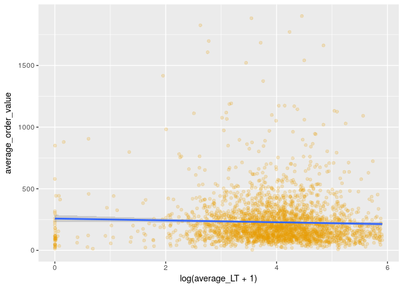

``` r
cor(groupy_reoderLT_orderValue$average_LT,groupy_reoderLT_orderValue$average_order_value)
```

    ## [1] -0.06743476

The average reorder leadtime and the average order value are very weakly correlated (Pearson correlation = -0.067), we can exclude this feature from the predictors.

#### Influence of the day of the week and hour of the day on the order value

This would be a critical factor when looking at the next purchase time. In our case (predicting the next order value), this aspect is less relevant, but still intersting. Is there a buying pattern along the day and hour of the last purchases ? (Assuming the purchase time corresponds to the invoicing timestamp).

``` r
df$dayofweek <- wday(df$InvoiceDate,label = TRUE)
df$hourofday <- as.factor(hour(df$InvoiceDate))
ggplot(df %>% sample_n(3000),aes(x=dayofweek,y=hourofday,size=OrderValue,color=Country))+ geom_jitter(width = 0.1,alpha=0.3)+theme(legend.position="none")
```

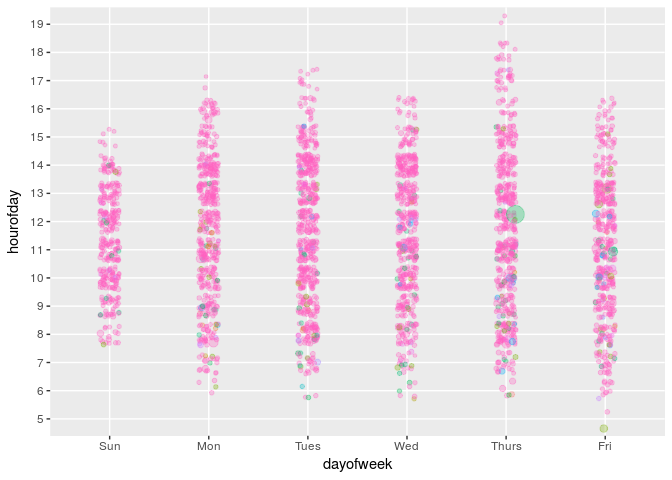

``` r
model<-lm(OrderValue~dayofweek+hourofday,data=df)
summary(model)
```

    ## 
    ## Call:
    ## lm(formula = OrderValue ~ dayofweek + hourofday, data = df)
    ## 
    ## Residuals:
    ##    Min     1Q Median     3Q    Max 
    ##    -61    -15    -10     -2  38952 
    ## 
    ## Coefficients:
    ##             Estimate Std. Error t value Pr(>|t|)    
    ## (Intercept)  64.4147     7.8269   8.230  < 2e-16 ***
    ## dayofweek.L   5.2569     0.4871  10.791  < 2e-16 ***
    ## dayofweek.Q  -4.3357     0.4794  -9.044  < 2e-16 ***
    ## dayofweek.C   1.6422     0.4556   3.604 0.000313 ***
    ## dayofweek^4  -1.0880     0.4411  -2.467 0.013637 *  
    ## dayofweek^5  -1.3594     0.4349  -3.126 0.001772 ** 
    ## hourofday6  -33.1561     8.0410  -4.123 3.73e-05 ***
    ## hourofday7  -37.8497     7.8817  -4.802 1.57e-06 ***
    ## hourofday8  -39.5504     7.8523  -5.037 4.74e-07 ***
    ## hourofday9  -38.1033     7.8499  -4.854 1.21e-06 ***
    ## hourofday10 -45.0037     7.8433  -5.738 9.60e-09 ***
    ## hourofday11 -45.6378     7.8425  -5.819 5.91e-09 ***
    ## hourofday12 -46.3836     7.8451  -5.912 3.37e-09 ***
    ## hourofday13 -47.2219     7.8418  -6.022 1.73e-09 ***
    ## hourofday14 -49.3844     7.8447  -6.295 3.07e-10 ***
    ## hourofday15 -50.5201     7.8579  -6.429 1.28e-10 ***
    ## hourofday16 -45.5637     7.8991  -5.768 8.02e-09 ***
    ## hourofday17 -51.2524     7.9956  -6.410 1.46e-10 ***
    ## hourofday18 -51.0894     8.3452  -6.122 9.25e-10 ***
    ## hourofday19 -61.8990    11.7651  -5.261 1.43e-07 ***
    ## ---
    ## Signif. codes:  0 '***' 0.001 '**' 0.01 '*' 0.05 '.' 0.1 ' ' 1
    ## 
    ## Residual standard error: 103.8 on 319537 degrees of freedom
    ## Multiple R-squared:  0.002298,   Adjusted R-squared:  0.002238 
    ## F-statistic: 38.73 on 19 and 319537 DF,  p-value: < 2.2e-16

Saturday is missing : there are no invoice proceeded at this day. The correlation between time of purchase and its value are is non-existent. Thus this feature will not be considered for the model.

### Data preparation

Set a table with for each customerID : - average order value, - total order value, - number of orders, - cohort (as category), - n to n-5 orders value (as category), - country (as category) - ordered top selling product(boolean)

#### Create a table of average order value and total order value per Customer

``` r
df.orders<-df.per.CustomerID.InvoiceID %>% group_by(CustomerID) %>% summarise(average_order_value = log(mean(TotalValue)+1), number_orders=n(), total_order_value = sum(TotalValue))
```

#### Create a table of last n orders values per Customer

``` r
percentile.97<-quantile(df.orders$number_orders,probs = .97)

df.orders.sequence<-df.per.CustomerID.InvoiceID %>% filter(order_sequence<percentile.97  ) %>% spread(order_sequence,TotalValue)
df.orders.sequence<-df.orders.sequence %>%
  group_by(CustomerID) %>%
  summarise_each(funs(ifelse(sum(is.na(.)==FALSE)==0, NA, .[which(is.na(.)==FALSE)])), matches("[1-9]"))

colnames(df.orders.sequence) <- paste("order", colnames(df.orders.sequence), sep = "_")
names(df.orders.sequence)[names(df.orders.sequence) == 'order_CustomerID'] <- 'CustomerID'
df.orders.sequence <- df.orders.sequence %>%
      mutate_each(funs(replace(., is.na(.), 0)), -CustomerID)

df.orders.sequence <- df.orders.sequence %>% mutate_each(funs(log(.+1)),-CustomerID)
```

#### Create a table of cohorts categories:

``` r
df.cohort<- df.firstInvoice %>% select(CustomerID,cohort)
df.cohort$cohort<-as.character(df.cohort$cohort)
# dummify the data
dmy <- dummyVars(" ~ .", data = df.cohort)
df.cohort <- data.frame(predict(dmy, newdata = df.cohort))
```

#### Create a table of countries category

``` r
df.countries <- df.firstInvoice %>% select(CustomerID,Country)
df.countries$Country<-as.character(df.countries$Country)
# dummify the data
dmy <- dummyVars(" ~ .", data = df.countries)
df.countries <- data.frame(predict(dmy, newdata = df.countries))
```

#### Check if Customer ordered one of the top sellig items :

``` r
df$top.selling <- df$StockCode %in% as.character(top.selling.products)
table(df$top.selling)
```

    ## 
    ##  FALSE   TRUE 
    ## 265907  53650

``` r
df.top.selling<-df %>% select(CustomerID,top.selling) %>% group_by(CustomerID) %>% summarise(top.selling.purchase=n())
```

#### Combine all data in a single table

``` r
df.final<- merge(x=df.orders,y=df.cohort,by="CustomerID",all.x=TRUE)
df.final <- merge(x=df.final,y=df.orders.sequence,by="CustomerID",all.x=TRUE)
df.final <- merge(df.final,df.countries,by="CustomerID",all.x=TRUE)
df.final <- merge(df.final,df.top.selling,by="CustomerID",all.x=TRUE)

write.csv(df.final,'ukretail_dataset.csv')
```

### Features validation

We can make a rough check whether our choice of predictors is reasonable:

``` r
first.5.orders<-paste0("order_",seq(1,5))
ggpairs(df.orders.sequence %>% select(one_of(first.5.orders)))  + ggtitle("Correlation in the customer's last 5 orders")
```

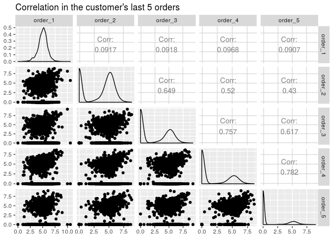

``` r
model<-lm(order_1~.-CustomerID,data=df.final)
summary(model)
```

    ## 
    ## Call:
    ## lm(formula = order_1 ~ . - CustomerID, data = df.final)
    ## 
    ## Residuals:
    ##     Min      1Q  Median      3Q     Max 
    ## -4.8231 -0.1163  0.0170  0.2836  2.3609 
    ## 
    ## Coefficients: (2 not defined because of singularities)
    ##                               Estimate Std. Error t value Pr(>|t|)    
    ## (Intercept)                 -1.062e-01  2.980e-01  -0.356 0.721623    
    ## average_order_value          1.032e+00  1.260e-02  81.859  < 2e-16 ***
    ## number_orders               -3.501e-03  2.569e-03  -1.362 0.173129    
    ## total_order_value           -4.707e-06  2.206e-06  -2.133 0.032964 *  
    ## cohort2010.12.01             1.587e-01  9.331e-02   1.701 0.089045 .  
    ## cohort2011.01.01             7.681e-02  9.491e-02   0.809 0.418386    
    ## cohort2011.02.01             9.079e-02  9.517e-02   0.954 0.340165    
    ## cohort2011.03.01             1.821e-02  9.410e-02   0.194 0.846570    
    ## cohort2011.04.01             1.223e-01  9.577e-02   1.277 0.201546    
    ## cohort2011.05.01             8.334e-02  9.642e-02   0.864 0.387481    
    ## cohort2011.06.01             9.934e-02  9.693e-02   1.025 0.305496    
    ## cohort2011.07.01             5.628e-02  9.892e-02   0.569 0.569415    
    ## cohort2011.08.01            -2.237e-02  1.001e-01  -0.223 0.823224    
    ## cohort2011.09.01            -2.339e-02  9.556e-02  -0.245 0.806681    
    ## cohort2011.10.01            -4.782e-02  9.413e-02  -0.508 0.611485    
    ## cohort2011.11.01            -1.896e-02  9.481e-02  -0.200 0.841502    
    ## cohort2011.12.01                    NA         NA      NA       NA    
    ## order_2                     -4.603e-02  4.637e-03  -9.927  < 2e-16 ***
    ## order_3                     -1.904e-02  5.700e-03  -3.341 0.000842 ***
    ## order_4                     -9.877e-04  6.692e-03  -0.148 0.882672    
    ## order_5                      4.424e-03  7.931e-03   0.558 0.577003    
    ## order_6                     -1.823e-02  9.516e-03  -1.915 0.055532 .  
    ## order_7                     -8.858e-03  1.078e-02  -0.822 0.411286    
    ## order_8                      1.451e-02  1.233e-02   1.177 0.239367    
    ## order_9                     -2.755e-02  1.411e-02  -1.952 0.051011 .  
    ## order_10                     2.703e-02  1.566e-02   1.726 0.084488 .  
    ## order_11                    -1.822e-02  1.732e-02  -1.052 0.292843    
    ## order_12                     3.610e-02  1.998e-02   1.807 0.070875 .  
    ## order_13                     9.701e-03  2.199e-02   0.441 0.659092    
    ## order_14                    -2.323e-03  2.584e-02  -0.090 0.928383    
    ## order_15                     1.555e-02  2.657e-02   0.585 0.558407    
    ## order_16                    -2.404e-02  1.917e-02  -1.254 0.209822    
    ## CountryAustralia            -6.088e-04  3.392e-01  -0.002 0.998568    
    ## CountryAustria              -4.176e-02  3.382e-01  -0.123 0.901723    
    ## CountryBahrain              -1.226e-01  4.874e-01  -0.252 0.801416    
    ## CountryBelgium               1.164e-01  3.042e-01   0.383 0.701930    
    ## CountryBrazil               -2.187e-01  6.274e-01  -0.349 0.727405    
    ## CountryCanada                1.057e-02  4.298e-01   0.025 0.980380    
    ## CountryChannel.Islands      -3.846e-01  3.382e-01  -1.137 0.255487    
    ## CountryCyprus                9.599e-03  3.527e-01   0.027 0.978287    
    ## CountryCzech.Republic       -4.048e-01  6.278e-01  -0.645 0.519095    
    ## CountryDenmark               2.042e-02  3.438e-01   0.059 0.952644    
    ## CountryEIRE                  6.362e-02  4.523e-01   0.141 0.888146    
    ## CountryEuropean.Community    7.054e-01  6.280e-01   1.123 0.261390    
    ## CountryFinland               5.199e-02  3.244e-01   0.160 0.872669    
    ## CountryFrance                2.801e-03  2.881e-01   0.010 0.992241    
    ## CountryGermany              -1.070e-01  2.874e-01  -0.372 0.709706    
    ## CountryGreece               -8.327e-02  3.965e-01  -0.210 0.833661    
    ## CountryIceland              -9.670e-01  6.292e-01  -1.537 0.124403    
    ## CountryIsrael               -3.876e-01  4.289e-01  -0.904 0.366224    
    ## CountryItaly                -6.296e-02  3.189e-01  -0.197 0.843523    
    ## CountryJapan                -4.634e-01  3.443e-01  -1.346 0.178418    
    ## CountryLebanon              -1.927e-01  6.279e-01  -0.307 0.758905    
    ## CountryLithuania            -1.551e+00  6.281e-01  -2.469 0.013575 *  
    ## CountryMalta                -5.283e-02  4.871e-01  -0.108 0.913627    
    ## CountryNetherlands          -2.471e-01  3.403e-01  -0.726 0.467895    
    ## CountryNorway               -4.824e-01  3.329e-01  -1.449 0.147382    
    ## CountryPoland                2.054e-01  3.773e-01   0.544 0.586287    
    ## CountryPortugal             -1.967e-01  3.096e-01  -0.635 0.525184    
    ## CountryRSA                  -5.155e-02  6.269e-01  -0.082 0.934470    
    ## CountrySaudi.Arabia         -1.254e-01  6.279e-01  -0.200 0.841741    
    ## CountrySingapore             1.358e+00  6.305e-01   2.153 0.031348 *  
    ## CountrySpain                -7.850e-02  3.006e-01  -0.261 0.794007    
    ## CountrySweden               -8.462e-03  3.449e-01  -0.025 0.980427    
    ## CountrySwitzerland          -8.145e-02  3.081e-01  -0.264 0.791528    
    ## CountryUnited.Arab.Emirates -1.140e+00  4.864e-01  -2.344 0.019146 *  
    ## CountryUnited.Kingdom       -4.949e-02  2.818e-01  -0.176 0.860613    
    ## CountryUnspecified          -1.803e-01  3.980e-01  -0.453 0.650493    
    ## CountryUSA                          NA         NA      NA       NA    
    ## top.selling.purchase         3.382e-04  1.010e-04   3.348 0.000820 ***
    ## ---
    ## Signif. codes:  0 '***' 0.001 '**' 0.01 '*' 0.05 '.' 0.1 ' ' 1
    ## 
    ## Residual standard error: 0.5601 on 4223 degrees of freedom
    ##   (1 observation deleted due to missingness)
    ## Multiple R-squared:  0.6557, Adjusted R-squared:  0.6502 
    ## F-statistic:   120 on 67 and 4223 DF,  p-value: < 2.2e-16

The last order does not correlate with the previous one, because we include the customer with a single order. For the other, their is a strong multicollinearity amongst then (0.43 to 0.782). The feature "Number of orders" might compensate this weakness in the model.

When using all the selected features, we get an adjusted determination factor of 0.65, which is not too bad.
