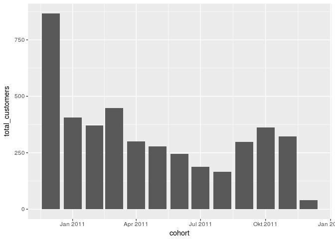
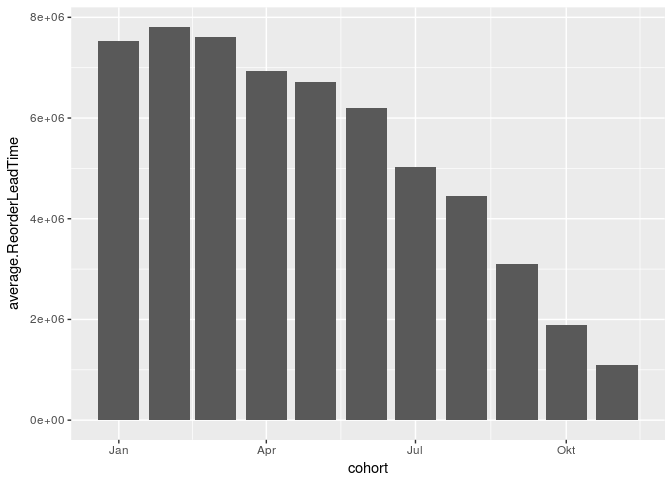
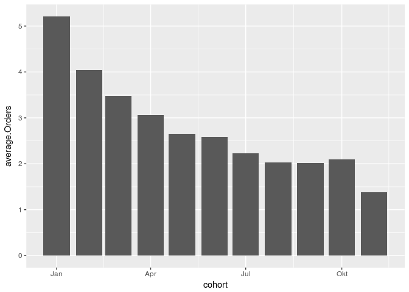
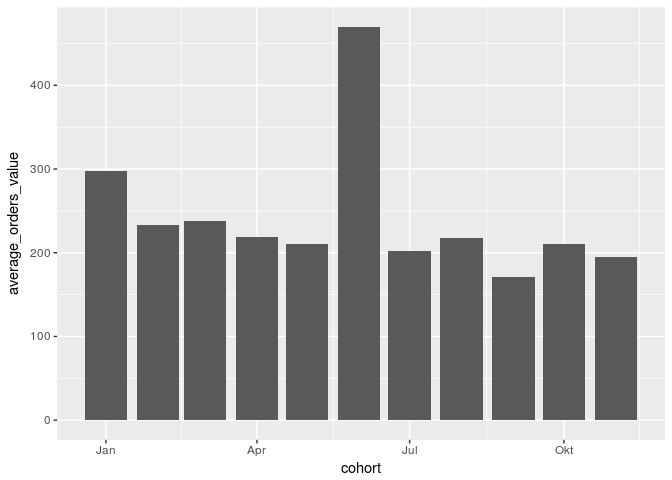
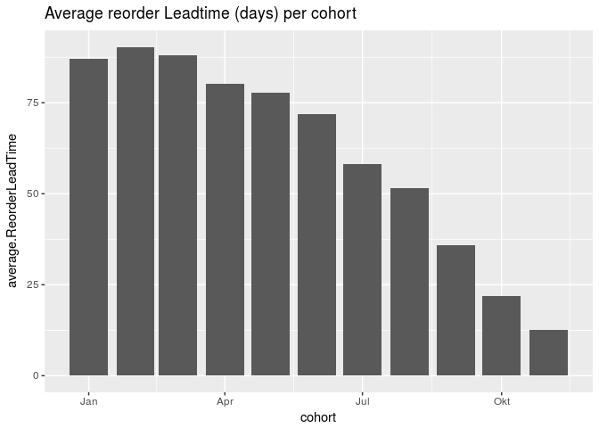
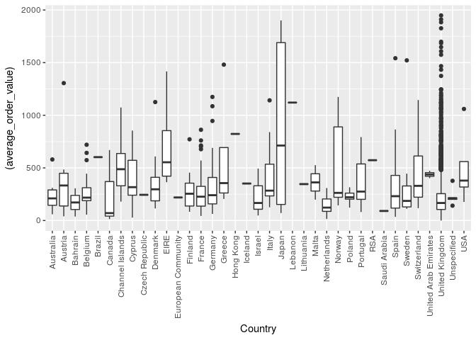
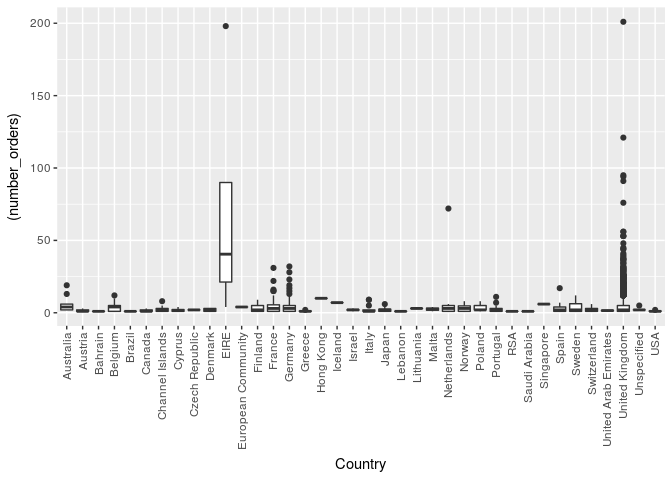
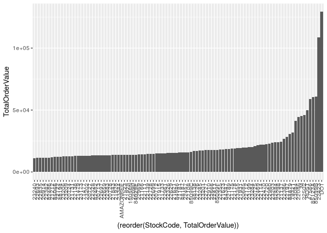
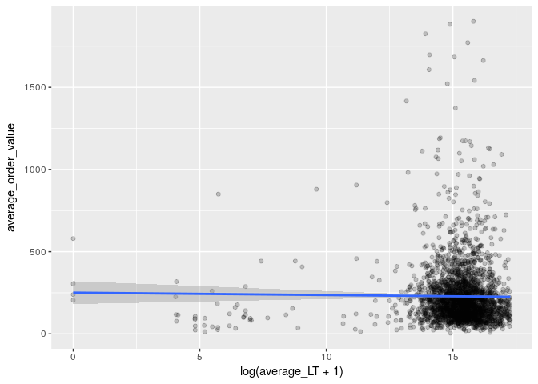
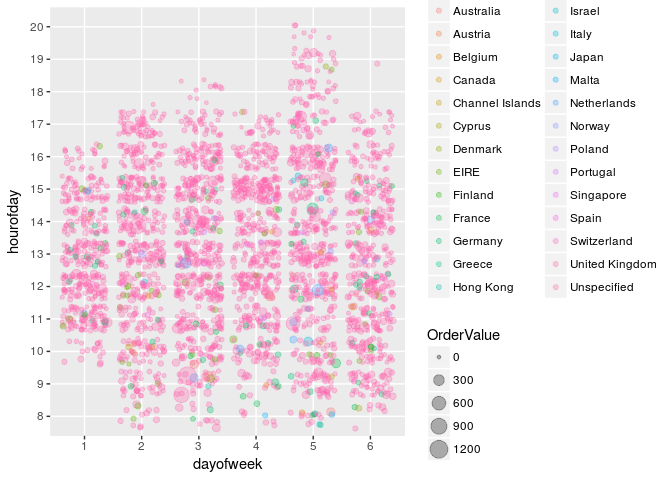

Hello Fresh
================

``` r
library(dplyr)
```

    ## 
    ## Attaching package: 'dplyr'

    ## The following objects are masked from 'package:stats':
    ## 
    ##     filter, lag

    ## The following objects are masked from 'package:base':
    ## 
    ##     intersect, setdiff, setequal, union

``` r
library(stringr)
library(tidyr)
library(ggplot2)
library(lubridate)
```

    ## 
    ## Attaching package: 'lubridate'

    ## The following object is masked from 'package:base':
    ## 
    ##     date

``` r
library(caret)
```

    ## Loading required package: lattice

``` r
sessionInfo()
```

    ## R version 3.4.0 (2017-04-21)
    ## Platform: x86_64-pc-linux-gnu (64-bit)
    ## Running under: Ubuntu 16.04.2 LTS
    ## 
    ## Matrix products: default
    ## BLAS: /usr/lib/openblas-base/libblas.so.3
    ## LAPACK: /usr/lib/libopenblasp-r0.2.18.so
    ## 
    ## locale:
    ##  [1] LC_CTYPE=en_US.UTF-8       LC_NUMERIC=C              
    ##  [3] LC_TIME=de_DE.UTF-8        LC_COLLATE=en_US.UTF-8    
    ##  [5] LC_MONETARY=de_DE.UTF-8    LC_MESSAGES=en_US.UTF-8   
    ##  [7] LC_PAPER=de_DE.UTF-8       LC_NAME=C                 
    ##  [9] LC_ADDRESS=C               LC_TELEPHONE=C            
    ## [11] LC_MEASUREMENT=de_DE.UTF-8 LC_IDENTIFICATION=C       
    ## 
    ## attached base packages:
    ## [1] stats     graphics  grDevices utils     datasets  methods   base     
    ## 
    ## other attached packages:
    ## [1] caret_6.0-76    lattice_0.20-35 lubridate_1.6.0 ggplot2_2.2.1  
    ## [5] tidyr_0.6.2     stringr_1.1.0   dplyr_0.5.0    
    ## 
    ## loaded via a namespace (and not attached):
    ##  [1] Rcpp_0.12.10       nloptr_1.0.4       compiler_3.4.0    
    ##  [4] plyr_1.8.4         iterators_1.0.8    tools_3.4.0       
    ##  [7] digest_0.6.10      lme4_1.1-13        evaluate_0.10     
    ## [10] tibble_1.3.0       gtable_0.2.0       nlme_3.1-131      
    ## [13] mgcv_1.8-17        Matrix_1.2-10      foreach_1.4.3     
    ## [16] DBI_0.6-1          parallel_3.4.0     yaml_2.1.14       
    ## [19] SparseM_1.77       knitr_1.15.1       MatrixModels_0.4-1
    ## [22] stats4_3.4.0       rprojroot_1.2      grid_3.4.0        
    ## [25] nnet_7.3-12        R6_2.2.0           rmarkdown_1.5     
    ## [28] minqa_1.2.4        reshape2_1.4.2     car_2.1-4         
    ## [31] magrittr_1.5       splines_3.4.0      backports_1.0.5   
    ## [34] scales_0.4.1       codetools_0.2-15   ModelMetrics_1.1.0
    ## [37] htmltools_0.3.6    MASS_7.3-47        assertthat_0.2.0  
    ## [40] pbkrtest_0.4-7     colorspace_1.3-2   quantreg_5.33     
    ## [43] stringi_1.1.2      lazyeval_0.2.0     munsell_0.4.3

``` r
data <- read.csv("UKretail.csv")
str(data)
```

    ## 'data.frame':    325145 obs. of  8 variables:
    ##  $ InvoiceNo  : Factor w/ 23193 levels "536365","536366",..: 1 1 1 1 2 3 3 3 3 3 ...
    ##  $ StockCode  : Factor w/ 3947 levels "10002","10080",..: 1644 2755 2934 3449 1529 802 803 815 1229 1637 ...
    ##  $ Description: Factor w/ 4070 levels "?","??","???",..: 3170 3887 1878 3879 1619 1711 2003 2768 1772 2698 ...
    ##  $ Quantity   : int  2 6 6 6 6 3 3 4 6 6 ...
    ##  $ InvoiceDate: Factor w/ 21213 levels "2010-12-01 08:26:02",..: 1 1 1 1 2 3 3 3 3 3 ...
    ##  $ UnitPrice  : num  7.65 3.39 3.39 2.55 1.85 5.95 5.95 7.95 1.65 2.1 ...
    ##  $ CustomerID : int  17850 17850 17850 17850 17850 13047 13047 13047 13047 13047 ...
    ##  $ Country    : Factor w/ 38 levels "Australia","Austria",..: 36 36 36 36 36 36 36 36 36 36 ...

### Format date time, remove cancelled orders.

``` r
df<-data
df$InvoiceDate <-as_datetime((df$InvoiceDate))
df$OrderValue <- df$Quantity * df$UnitPrice
df<- df %>% filter(!grepl("^C",InvoiceNo))
str(df)
```

    ## 'data.frame':    319558 obs. of  9 variables:
    ##  $ InvoiceNo  : Factor w/ 23193 levels "536365","536366",..: 1 1 1 1 2 3 3 3 3 3 ...
    ##  $ StockCode  : Factor w/ 3947 levels "10002","10080",..: 1644 2755 2934 3449 1529 802 803 815 1229 1637 ...
    ##  $ Description: Factor w/ 4070 levels "?","??","???",..: 3170 3887 1878 3879 1619 1711 2003 2768 1772 2698 ...
    ##  $ Quantity   : int  2 6 6 6 6 3 3 4 6 6 ...
    ##  $ InvoiceDate: POSIXct, format: "2010-12-01 08:26:02" "2010-12-01 08:26:02" ...
    ##  $ UnitPrice  : num  7.65 3.39 3.39 2.55 1.85 5.95 5.95 7.95 1.65 2.1 ...
    ##  $ CustomerID : int  17850 17850 17850 17850 17850 13047 13047 13047 13047 13047 ...
    ##  $ Country    : Factor w/ 38 levels "Australia","Austria",..: 36 36 36 36 36 36 36 36 36 36 ...
    ##  $ OrderValue : num  15.3 20.3 20.3 15.3 11.1 ...

### Aggregate by CustomerID and InvoiceID :

``` r
df.per.CustomerID.InvoiceID <- df %>% group_by(CustomerID,InvoiceNo,InvoiceDate,Country) %>% summarise(TotalValue=sum(OrderValue)) 
df.per.CustomerID.InvoiceID<- df.per.CustomerID.InvoiceID %>% group_by(CustomerID)  %>% mutate(PreviousInvoiceDate = lag(InvoiceDate))
df.per.CustomerID.InvoiceID <- df.per.CustomerID.InvoiceID %>%  arrange(desc(InvoiceDate)) %>% mutate(order_sequence=row_number())
df.per.CustomerID.InvoiceID$ReorderLeadTime<-df.per.CustomerID.InvoiceID$InvoiceDate-df.per.CustomerID.InvoiceID$PreviousInvoiceDate
```

### group per cohort

``` r
df.firstInvoice <-df %>%
  group_by(CustomerID) %>%
  arrange(InvoiceDate) %>%
  filter(row_number()==1 )

df.firstInvoice$cohort<- as.Date(floor_date(df.firstInvoice$InvoiceDate, "month"))
groupy_cohort<- df.firstInvoice %>% group_by(cohort) %>% summarise(total_customers=n())

ggplot(data=groupy_cohort,aes(x=cohort,y=total_customers))+geom_bar(stat = "identity")
```



The first cohort (first invoice in December 2010) should not be taken into account, as it also include Customers having first ordered before 1st December 2010.

### Frequency and Value of Orders per cohort

``` r
df.per.CustomerID <- merge(x=df.per.CustomerID.InvoiceID,y=df.firstInvoice[, c("CustomerID","cohort")],by="CustomerID",all.x=TRUE)

df.per.CustomerID<-df.per.CustomerID%>% filter(cohort>"2010-12-01" & cohort<"2011-12-01" )

groupy_frequency <- df.per.CustomerID %>% filter(!is.na(ReorderLeadTime)) %>%  group_by(CustomerID,cohort) %>% summarise(average.ReorderLeadTime=mean(ReorderLeadTime),number_orders=n(), orders_value=mean(TotalValue))

groupy_frequency_cohort<- groupy_frequency %>% group_by(cohort) %>% summarise(average.ReorderLeadTime=mean(average.ReorderLeadTime),average.Orders=mean(number_orders),average_orders_value=mean(orders_value))


ggplot(data=groupy_frequency_cohort,aes(x=cohort,y=average.ReorderLeadTime))+ geom_bar(stat = "identity")
```

    ## Don't know how to automatically pick scale for object of type difftime. Defaulting to continuous.



``` r
ggplot(data=groupy_frequency_cohort,aes(x=cohort,y=average.Orders))+ geom_bar(stat = "identity")
```



``` r
ggplot(data=groupy_frequency_cohort,aes(x=cohort,y=average_orders_value))+ geom_bar(stat = "identity")
```

 \#\#\# Number of orders per cohort

``` r
ggplot(data =groupy_frequency,aes(x=cohort,y=number_orders,group=cohort)) + geom_boxplot()
```

 \#\#\# Importance of the country for the order value \#\#\# Data preparation

``` r
groupy_country <- df.per.CustomerID.InvoiceID %>% group_by(CustomerID,Country) %>% summarise(average_order_value = mean(TotalValue), number_orders = n())
ggplot(data=groupy_country %>% filter(average_order_value<2000),aes(x=Country,y=(average_order_value)))+geom_boxplot()+theme(axis.text.x=element_text(angle=90,hjust=1,vjust=0.5))
```



``` r
ggplot(data=groupy_country %>% filter(number_orders<500) ,aes(x=Country,y=(number_orders)))+geom_boxplot()+theme(axis.text.x=element_text(angle=90,hjust=1,vjust=0.5))
```



``` r
mean(groupy_country$number_orders)
```

    ## [1] 4.737172

According to this chart, the order value seems to be correlated with the country of origin. We can thus keep this feature as a good predictor for the next Order Value. When looking at the distribution of orders per customer for each country, with the exception of EIRE, the average number of order is around 5.

### Define products categories

``` r
groupy.StockCode<- df %>% group_by(StockCode) %>% summarise(TotalOrderValue = sum(OrderValue)) %>% arrange(desc(TotalOrderValue)) %>% top_n(100,TotalOrderValue)
length(unique(df$StockCode))
```

    ## [1] 3937

``` r
sum(groupy.StockCode$TotalOrderValue)/sum(df$OrderValue)
```

    ## [1] 0.3388447

``` r
ggplot(data=groupy.StockCode,aes(x=(reorder(StockCode, TotalOrderValue)),y=TotalOrderValue))+geom_bar(stat = "identity")+theme(axis.text.x=element_text(angle=90,hjust=1,vjust=0.5))
```



``` r
top.selling.products<- groupy.StockCode$StockCode
```

The top 100 Products (2.5% of the total catalog) accounts to one third of the total TurnOver, we could as a matter of keeping it simple, define a new variable for each customer and each order, whether he did order one of those items.

Ideally, we should cluster the StockCode to define groups of buying profiles, but given the number of features (3937), such a sparse matrix would be hard to handle on a laptop. An other approach would to be define sub-groups of product (Bags, Boxes, Pen, etc...) using word vectorization on the variable Description.

### Influence of the ReorderLeadtime on the average Order Value

``` r
groupy_reoderLT_orderValue <- df.per.CustomerID.InvoiceID %>% group_by(CustomerID) %>% summarise(average_LT=as.numeric(mean(ReorderLeadTime,na.rm=TRUE)), average_order_value=mean(TotalValue,na.rm=TRUE)) %>% filter(!is.na(average_LT)) %>% filter(average_order_value<2000)

ggplot(data=groupy_reoderLT_orderValue,aes(x=log(average_LT+1),y=average_order_value)) + geom_point(alpha=0.2)+ geom_smooth(method = 'lm')
```



``` r
cor(groupy_reoderLT_orderValue$average_LT,groupy_reoderLT_orderValue$average_order_value)
```

    ## [1] -0.06741886

The average reorder leadtime and the average order value are very weakly correlated, we can exclude this feature from the predictors.

#### Influence of the day of the week and hour of the day on the order value

``` r
df$dayofweek <- as.factor(wday(df$InvoiceDate))
df$hourofday <- as.factor(hour(df$InvoiceDate))
ggplot(df %>% sample_n(3000),aes(x=dayofweek,y=hourofday,size=OrderValue,color=Country))+ geom_jitter(alpha=0.3)
```



``` r
model<-lm(OrderValue~dayofweek+hourofday,data=df)
summary(model)
```

    ## 
    ## Call:
    ## lm(formula = OrderValue ~ dayofweek + hourofday, data = df)
    ## 
    ## Residuals:
    ##    Min     1Q Median     3Q    Max 
    ## -11081    -15     -9     -2  38951 
    ## 
    ## Coefficients:
    ##             Estimate Std. Error t value Pr(>|t|)    
    ## (Intercept)  70.5109     7.1313   9.888  < 2e-16 ***
    ## dayofweek2    6.0475     0.7111   8.505  < 2e-16 ***
    ## dayofweek3    8.5171     0.6996  12.174  < 2e-16 ***
    ## dayofweek4    7.0536     0.7082   9.959  < 2e-16 ***
    ## dayofweek5    8.9790     0.7095  12.655  < 2e-16 ***
    ## dayofweek6    7.2400     0.7314   9.899  < 2e-16 ***
    ## hourofday8  -45.1667     7.2542  -6.226 4.78e-10 ***
    ## hourofday9  -53.8335     7.1449  -7.535 4.91e-14 ***
    ## hourofday10 -49.3264     7.1344  -6.914 4.73e-12 ***
    ## hourofday11 -54.6917     7.1311  -7.669 1.73e-14 ***
    ## hourofday12 -58.1274     7.1245  -8.159 3.40e-16 ***
    ## hourofday13 -58.6269     7.1264  -8.227  < 2e-16 ***
    ## hourofday14 -59.0241     7.1272  -8.281  < 2e-16 ***
    ## hourofday15 -58.9220     7.1248  -8.270  < 2e-16 ***
    ## hourofday16 -63.6651     7.1321  -8.927  < 2e-16 ***
    ## hourofday17 -61.3926     7.1545  -8.581  < 2e-16 ***
    ## hourofday18 -61.6354     7.2779  -8.469  < 2e-16 ***
    ## hourofday19 -66.0513     7.4774  -8.833  < 2e-16 ***
    ## hourofday20 -56.9547     8.6140  -6.612 3.80e-11 ***
    ## ---
    ## Signif. codes:  0 '***' 0.001 '**' 0.01 '*' 0.05 '.' 0.1 ' ' 1
    ## 
    ## Residual standard error: 105.6 on 319539 degrees of freedom
    ## Multiple R-squared:  0.0023, Adjusted R-squared:  0.002244 
    ## F-statistic: 40.93 on 18 and 319539 DF,  p-value: < 2.2e-16

### Data preparation

Set a table with for each customerID : - average order value, - total order value, - number of orders, - cohort (as category), - n to n-5 orders value (as category), - country (as category) - ordered top selling product(boolean)

#### Create a table of average order value and total order value per Customer

``` r
df.orders<-df.per.CustomerID.InvoiceID %>% group_by(CustomerID) %>% summarise(average_order_value = mean(TotalValue), number_orders=n(), total_order_value = sum(TotalValue))
```

#### Create a table of last n orders values per Customer

``` r
quantile(df.orders$number_orders,probs = .90)
```

    ## 90% 
    ##   9

``` r
df.orders.sequence<-df.per.CustomerID.InvoiceID %>% filter(order_sequence<10) %>% spread(order_sequence,TotalValue)
df.orders.sequence<-df.orders.sequence %>%
  group_by(CustomerID) %>%
  summarise_each(funs(ifelse(sum(is.na(.)==FALSE)==0, NA, .[which(is.na(.)==FALSE)])), matches("[1-9]"))

colnames(df.orders.sequence) <- paste("order_sequence", colnames(df.orders.sequence), sep = "_")
names(df.orders.sequence)[names(df.orders.sequence) == 'order_sequence_CustomerID'] <- 'CustomerID'
df.orders.sequence <- df.orders.sequence %>%
      mutate_each(funs(replace(., is.na(.), 0)), -CustomerID)

df.orders.sequence <- df.orders.sequence %>% mutate_each(funs(log(.+1)),-CustomerID)
```

#### Create a table of cohorts categories:

``` r
df.cohort<- df.firstInvoice %>% select(CustomerID,cohort)
df.cohort$cohort<-as.character(df.cohort$cohort)
# dummify the data
dmy <- dummyVars(" ~ .", data = df.cohort,)
df.cohort <- data.frame(predict(dmy, newdata = df.cohort))
```

#### Create a table of countries category

``` r
df.countries <- df.firstInvoice %>% select(CustomerID,Country)
df.countries$Country<-as.character(df.countries$Country)
# dummify the data
dmy <- dummyVars(" ~ .", data = df.countries)
df.countries <- data.frame(predict(dmy, newdata = df.countries))
```

#### Check if Customer ordered one of the top sellig items :

``` r
df$top.selling <- df$StockCode %in% as.character(top.selling.products)
table(df$top.selling)
```

    ## 
    ##  FALSE   TRUE 
    ## 265908  53650

``` r
df.top.selling<-df %>% select(CustomerID,top.selling) %>% group_by(CustomerID) %>% summarise(top.selling.purchase=n())
```

#### Combine all data in a single table

``` r
df.final<- merge(x=df.orders,y=df.cohort,by="CustomerID",all.x=TRUE)
df.final <- merge(x=df.final,y=df.orders.sequence,by="CustomerID",all.x=TRUE)
df.final <- merge(df.final,df.countries,by="CustomerID",all.x=TRUE)
df.final <- merge(df.final,df.top.selling,by="CustomerID",all.x=TRUE)

write.csv(df.final,'ukretail_dataset.csv')
```

### Features validation

We can make a rough check whether our choice of predictor is reasonable:

``` r
model<-lm(order_sequence_1~.-CustomerID,data=df.final)
summary(model)
```

    ## 
    ## Call:
    ## lm(formula = order_sequence_1 ~ . - CustomerID, data = df.final)
    ## 
    ## Residuals:
    ##      Min       1Q   Median       3Q      Max 
    ## -11.8503  -0.3943   0.1072   0.5465   2.9018 
    ## 
    ## Coefficients: (2 not defined because of singularities)
    ##                               Estimate Std. Error t value Pr(>|t|)    
    ## (Intercept)                  5.538e+00  4.301e-01  12.877  < 2e-16 ***
    ## average_order_value          8.996e-04  3.353e-05  26.830  < 2e-16 ***
    ## number_orders               -1.933e-02  3.516e-03  -5.499 4.04e-08 ***
    ## total_order_value            4.045e-06  3.398e-06   1.190  0.23406    
    ## cohort2010.12.01             4.215e-02  1.390e-01   0.303  0.76164    
    ## cohort2011.01.01            -2.459e-02  1.414e-01  -0.174  0.86187    
    ## cohort2011.02.01             1.518e-02  1.418e-01   0.107  0.91471    
    ## cohort2011.03.01            -2.769e-02  1.402e-01  -0.198  0.84342    
    ## cohort2011.04.01             8.396e-02  1.427e-01   0.588  0.55630    
    ## cohort2011.05.01             2.516e-02  1.436e-01   0.175  0.86098    
    ## cohort2011.06.01            -8.408e-02  1.443e-01  -0.583  0.56022    
    ## cohort2011.07.01             3.355e-02  1.474e-01   0.228  0.81992    
    ## cohort2011.08.01            -6.006e-02  1.491e-01  -0.403  0.68721    
    ## cohort2011.09.01             1.329e-01  1.423e-01   0.934  0.35050    
    ## cohort2011.10.01             2.542e-02  1.402e-01   0.181  0.85615    
    ## cohort2011.11.01            -2.088e-02  1.413e-01  -0.148  0.88249    
    ## cohort2011.12.01                    NA         NA      NA       NA    
    ## order_sequence_2             2.009e-03  6.824e-03   0.294  0.76850    
    ## order_sequence_3             1.707e-03  8.473e-03   0.201  0.84038    
    ## order_sequence_4             1.438e-02  9.960e-03   1.444  0.14887    
    ## order_sequence_5             7.778e-03  1.181e-02   0.659  0.51007    
    ## order_sequence_6            -8.182e-03  1.416e-02  -0.578  0.56343    
    ## order_sequence_7            -2.848e-03  1.600e-02  -0.178  0.85875    
    ## order_sequence_8             1.468e-02  1.826e-02   0.804  0.42129    
    ## order_sequence_9             2.210e-02  1.681e-02   1.315  0.18870    
    ## CountryAustralia            -7.022e-01  5.043e-01  -1.392  0.16389    
    ## CountryAustria              -3.667e-01  5.037e-01  -0.728  0.46663    
    ## CountryBahrain              -1.014e+00  7.258e-01  -1.398  0.16229    
    ## CountryBelgium              -3.783e-01  4.529e-01  -0.835  0.40360    
    ## CountryBrazil                2.345e-01  9.346e-01   0.251  0.80189    
    ## CountryCanada               -1.303e+00  6.397e-01  -2.037  0.04171 *  
    ## CountryChannel.Islands      -3.877e-01  5.037e-01  -0.770  0.44157    
    ## CountryCyprus               -3.810e-01  5.253e-01  -0.725  0.46829    
    ## CountryCzech.Republic       -7.810e-01  9.351e-01  -0.835  0.40370    
    ## CountryDenmark              -2.959e-01  5.122e-01  -0.578  0.56343    
    ## CountryEIRE                 -2.493e-01  6.693e-01  -0.372  0.70955    
    ## CountryEuropean.Community    1.165e-01  9.354e-01   0.125  0.90090    
    ## CountryFinland              -4.665e-01  4.828e-01  -0.966  0.33394    
    ## CountryFrance               -5.759e-01  4.289e-01  -1.343  0.17942    
    ## CountryGermany              -5.959e-01  4.280e-01  -1.392  0.16387    
    ## CountryGreece               -1.337e-02  5.906e-01  -0.023  0.98194    
    ## CountryIceland              -1.375e+00  9.372e-01  -1.467  0.14253    
    ## CountryIsrael               -9.809e-01  6.391e-01  -1.535  0.12492    
    ## CountryItaly                -2.627e-01  4.749e-01  -0.553  0.58026    
    ## CountryJapan                -6.750e-01  5.130e-01  -1.316  0.18832    
    ## CountryLebanon               4.874e-01  9.352e-01   0.521  0.60228    
    ## CountryLithuania            -1.726e+00  9.356e-01  -1.845  0.06511 .  
    ## CountryMalta                -1.288e-01  7.255e-01  -0.178  0.85911    
    ## CountryNetherlands          -1.317e+00  5.064e-01  -2.600  0.00935 ** 
    ## CountryNorway               -7.232e-01  4.960e-01  -1.458  0.14486    
    ## CountryPoland               -2.699e-01  5.620e-01  -0.480  0.63104    
    ## CountryPortugal             -4.416e-01  4.611e-01  -0.958  0.33834    
    ## CountryRSA                   2.562e-01  9.338e-01   0.274  0.78384    
    ## CountrySaudi.Arabia         -1.103e+00  9.351e-01  -1.180  0.23808    
    ## CountrySingapore             9.793e-01  9.398e-01   1.042  0.29746    
    ## CountrySpain                -5.672e-01  4.476e-01  -1.267  0.20517    
    ## CountrySweden               -4.929e-01  5.132e-01  -0.960  0.33687    
    ## CountrySwitzerland          -2.012e-01  4.591e-01  -0.438  0.66124    
    ## CountryUnited.Arab.Emirates -1.102e+00  7.246e-01  -1.521  0.12826    
    ## CountryUnited.Kingdom       -8.298e-01  4.194e-01  -1.978  0.04797 *  
    ## CountryUnspecified          -6.902e-01  5.927e-01  -1.165  0.24427    
    ## CountryUSA                          NA         NA      NA       NA    
    ## top.selling.purchase         1.053e-03  1.475e-04   7.137 1.12e-12 ***
    ## ---
    ## Signif. codes:  0 '***' 0.001 '**' 0.01 '*' 0.05 '.' 0.1 ' ' 1
    ## 
    ## Residual standard error: 0.8344 on 4230 degrees of freedom
    ##   (1 observation deleted due to missingness)
    ## Multiple R-squared:  0.2348, Adjusted R-squared:  0.224 
    ## F-statistic: 21.63 on 60 and 4230 DF,  p-value: < 2.2e-16
